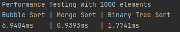

# Sparta Global SortManager Project

### What is the project about?
This project is a sort manager that can take user input to generate an array of random numbers or user specified numbers and sort those numbers.
It includes a bubble sorter, merge sorter, and a binary tree that has a binary tree sorter.

The program outputs the unsorted array, the sort algorithm used, the sorted array, and the time taken to sort the array.

### What are the different tools used?
- Maven is used for build automatic and dependency management (such as for the tools listed below)
- JUnit is used for unit testing of the project and to facilitate TDD.
- Log4j is used for logging

### What are the different functionalities?
There is the implementation for a binary tree including getting a sorted tree. There is also merge and bubble sorting algorithms.

A SorterFactory is used.

There is a random number generator that can generate a specified amount of numbers within a range. There is the option for choosing between unique or non-unique random numbers 

### Performance testing results
As can be seen from the performance results both Merge Sort and Binary Tree Sort have similar times for sorting numbers as they have the same time efficiency of O(n*log n). Merge sort tends to be slightly faster.
Bubble Sort is slower with average time complexity of O(n^2).

### User Guide
Run the program and choose 1 for using randomly generated numbers or 2 if you would like to specify the numbers to sort.

#### Random Numbers
If you chose random numbers you will then be asked how many random numbers to generate. After that you will be asked the minimum number and the maximum number generated.

#### User Inputted Numbers
If you chose to input the numbers you will be asked how many numbers you want to sort. After this you enter the individual numbers and press enter.

#### Sorting Algorithm
After you have selected the numbers you will be then asked what sorting algorithm you want to use.

- 1 for BubbleSort
- 2 for MergeSort
- 3 for BinaryTree
- 4 for using all sorting algorithms

After this the program will sort the numbers and display this along with the time taken and your original unsorted numbers